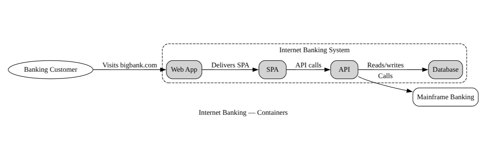

#+TITLE: drawl
#+SUBTITLE: Diagrams Rendered As Walked Lists.
#+OPTIONS: toc:nil num:nil

/A Lisp for diagrams. C4-aligned, browser-native, CLI-friendly./

drawl is a small Lisp surface for declaring diagrams. Forms nest, edges reference elements by name, attributes are keyword/value pairs. The compiler reads source as Clojure forms, walks them into a single IR, and emits a backend string (graphviz dot today; mermaid C4 + Excalidraw planned).

The same =.cljc= core ships three targets:
- a *browser SPA* with live preview (shadow-cljs + viz.js),
- a *Babashka CLI* (=drawl compile|render|lint|watch=, distributed via =bbin=),
- a *JVM library* under =drawl.compiler=.

* Status

Pre-v0.1, in flight. Vertical slices delivered: parser, walker, IR, dot emitter, level inference (=:context= / =:container= / =:component=), at-level filter, nesting validation, ref/duplicate-id checks, and a live shadow-cljs preview with CodeMirror 6 + clojure-mode. See [[file:GRAMMAR.org][GRAMMAR.org]] for the source language, [[file:SPEC.org][SPEC.org]] for the full design, and [[file:AGENTS.md][AGENTS.md]] for the dev guide.

* Quick start

#+begin_src bash
nix develop                    # JVM, Clojure, Babashka, Node, graphviz, mermaid-cli
npm install                    # shadow-cljs + @viz-js/viz
npx shadow-cljs watch app      # live SPA at http://localhost:8090/
#+end_src

Run tests against a JVM REPL:

#+begin_src bash
clojure -M:test:nrepl          # nREPL on a free port; eval (clojure.test/run-all-tests)
#+end_src

* Example

#+begin_src lisp
(diagram "Internet Banking — Containers"
  (person customer "Banking Customer")

  (system bank "Internet Banking System"
    (container webapp "Web App")
    (container spa "SPA")
    (container api "API")
    (container db "Database")
    (-> spa api "API calls")
    (-> api db "Reads/writes"))

  (system mainframe "Mainframe Banking")

  (-> customer webapp "Visits bigbank.com")
  (-> webapp spa "Delivers SPA")
  (-> api mainframe "Calls"))
#+end_src

#+CAPTION: Rendered live in the SPA via shadow-cljs + viz.js.

Compile to dot:

#+begin_src clojure
(require '[drawl.compiler :as drawl])
(drawl/compile (slurp "examples/03-bank-containers.drawl") :dot)
#+end_src

More examples in [[file:examples/][=examples/=]].

* Architecture

#+begin_example
source string
  → parser     (clojure.edn/read-string on JVM/bb, cljs.reader/read-string in browser)
  → walker     (multimethod on form head; produces IR fragments)
  → IR         (one nested map: {:title :level :elements :relationships})
  → emitter    (drawl.emit.dot today; .mermaid + .excalidraw planned)
#+end_example

Public API in =drawl.compiler=: =parse=, =emit=, =compile=, =validate=, plus =drawl.ir/at-level= for filtering one source to context/container/component views.

* Highlights

** User macros — abstract over your own conventions

Define shorthands at the top of any source. Plain symbol substitution, no =eval=, no quoting gymnastics:

#+begin_src lisp
(defmacro service [id label tech]
  (container id label :tech tech))

(diagram "Trading Platform"
  (service api    "API"     "Phoenix")
  (service quotes "Quotes"  "Elixir + GenServer")
  (service ledger "Ledger"  "PostgreSQL"))
#+end_src

User macros override built-ins of the same name (with a warning) — last-write-wins, the way Lisp expects.

** Built-in shorthand for the boring 80%

#+begin_src lisp
(diagram "Banking"
  (webapp       web   "Customer Web")        ; → :tech "Web"
  (rest-api     api   "Banking API")         ; → :tech "REST API"
  (postgres-db  db    "Customer DB")         ; → :role :database, :tech "PostgreSQL"
  (redis-cache  cache "Session cache"))      ; → :role :database, :tech "Redis"
#+end_src

** Bidirectional edges, named or unnamed

#+begin_src lisp
(-> a b)                      ; a → b
(-> a b "uses")               ; a → b, labelled
(-> a b "calls" :tech "gRPC") ; with tech tag
(<-> a b "syncs")             ; a ↔ b
#+end_src

** Nested systems for system-of-systems landscapes

#+begin_src lisp
(diagram "Bank Group"
  (system retail "Retail Banking"
    (container web "Web"))
  (system corp "Corporate Banking"
    (container portal "Portal"))
  (-> retail corp "shares customer data"))
#+end_src

** One source, multiple zoom levels

Levels are *inferred* — deepest =:kind= wins (=component= > =container= > =context=). Filter the IR to a lower level for a context/container/component view of the same source:

#+begin_src clojure
(require '[drawl.compiler :as drawl]
         '[drawl.ir :as ir])

(def ir (drawl/parse src))
(drawl/emit ir :dot)                      ; full detail
(drawl/emit (ir/at-level :context ir) :dot) ; landscape view
#+end_src

** Live editor with paredit + cheatsheet

The browser SPA ships a CodeMirror 6 editor wired to nextjournal/clojure-mode (paren matching, slurp/barf, auto-close, syntax highlight). Press *Ctrl+/* for a built-in cheatsheet covering both keyboard shortcuts and drawl syntax.

* Roadmap

See [[file:SPEC.org::*8.][SPEC §8]]. Headlines:

- *v0.1* core compiler + browser MVP (in flight)
- *v0.2* C4 mapping + mermaid emitter
- *v0.3* Babashka CLI
- *v0.4* JVM library polish
- *v0.5* Excalidraw backend
- *v0.6* editor support (=drawl-mode= derived from =lisp-mode=, optional =drawl lsp= subcommand)

* License

TBD.
